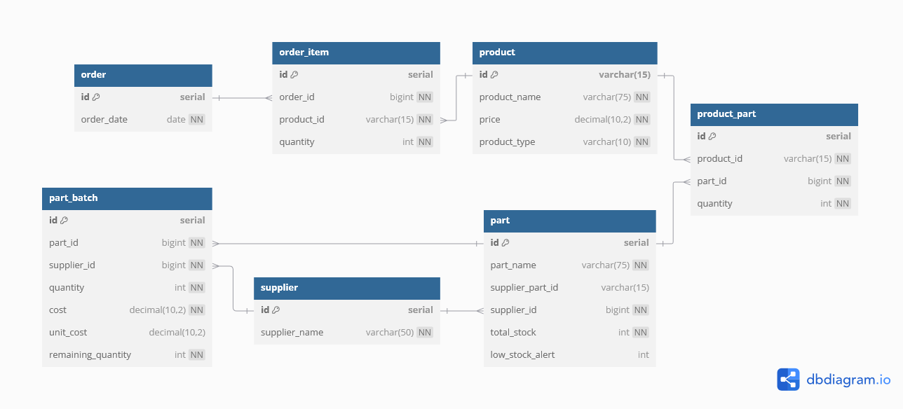

# Code First Girls - Introduction To Data & SQL Course & Project

Introduction to Data & SQL was an online course run by [Code First Girls](https://codefirstgirls.com/) to give an introduction into data analysis and SQL. Also as part of the course there was a project to create and give a presentation about it.

## Table of contents

- [Project Overview](#project-overview)
  - [Project Objectives](#project-objectives)
- [Database: Stock Management for Handmade Business](#database-stock-management-for-handmade-business)
  - [Database design and schema](#database-deign-and-schema)
  - [Database data](#database-data)
- [Project Process](#project-process)
  - [Project learning outcomes](#project-learning-outcomes)
  - [Useful resources](#useful-resources)
- [Author](#author)

## Project Overview

TODO: Brief explanation about project

### Project objectives

- Project was to create a database
- Project core requirements:
  - ❎ Create relational DB with minimum 5 tables
  - ❎ Set Primary and Foreign Key constraints to create relations between the tables
  - ❎ Using any type of joins, create a view that combines multiple tables in a logical way
  - ❎ In the DB, create a stored function that can be applied to a query in the DB
  - ⬜ Prepare an example query with a subquery to demonstrate how to extract data from the DB for analysis
  - ❎ Create DB diagram where all table relations are shown
- Project advanced requirements (include 2-3 minimum):
  - ⬜ In the DB, create a stored procedure and demonstrate how it runs
  - ❎ In the DB, create a trigger and demonstrate how it runs
  - ⬜ In the DB, create an event and demonstrate how it runs
  - ⬜ Create a view that uses at least 3-4 base tables; prepare and demonstrate a query that uses the view to produce a logically arranged result set for analysis
  - ⬜ Prepare an example query with group by and having to demonstrate how to extract data from the DB for analysis
- ⬜ Present a 3 minute presentation to the group explaining the idea behind the DB (use DB diagram), what it is for and how it is expected to be used. Run sample queries to demonstrate how the functions, stored procedures etc work. Show snippets of data stored in the tables.

## Database: Stock Management for Handmade Business

TODO: Brief explanation about choice of database

### Database deign and schema

TODO: Explain choice of tables and how interlinked, include about ensuring a part's ID from a supplier is unique

```sql
  CONSTRAINT unique_supplier_part_id UNIQUE (supplier_id, supplier_part_id)
```



### Database data

## Project Process

### Project learning outcomes

- Use `` around reserved keywords in SQL e.g.:
  ```sql
  CREATE TABLE `order` (
  	id SERIAL,
    PRIMARY KEY (id)
  );
  ```
- `SERIAL` is an alias for `BIGINT UNSIGNED NOT NULL AUTO_INCREMENT` therefore id referencing as a foreign key the data type needs to be `BIGINT UNSIGNED`.

  ```sql
  CREATE TABLE part (
    id SERIAL,
    ...
    PRIMARY KEY (id)
  );

  CREATE TABLE part_batch (
    id SERIAL,
    part_id BIGINT UNSIGNED,
    ...
    PRIMARY KEY (id),
    FOREIGN KEY (part_id) REFERENCES part(id), -- 1 to many relationship
    ...
  );
  ```

### Useful resources

- [dbdiagram.io](https://dbdiagram.io/home)

## Author

V. Tickner
